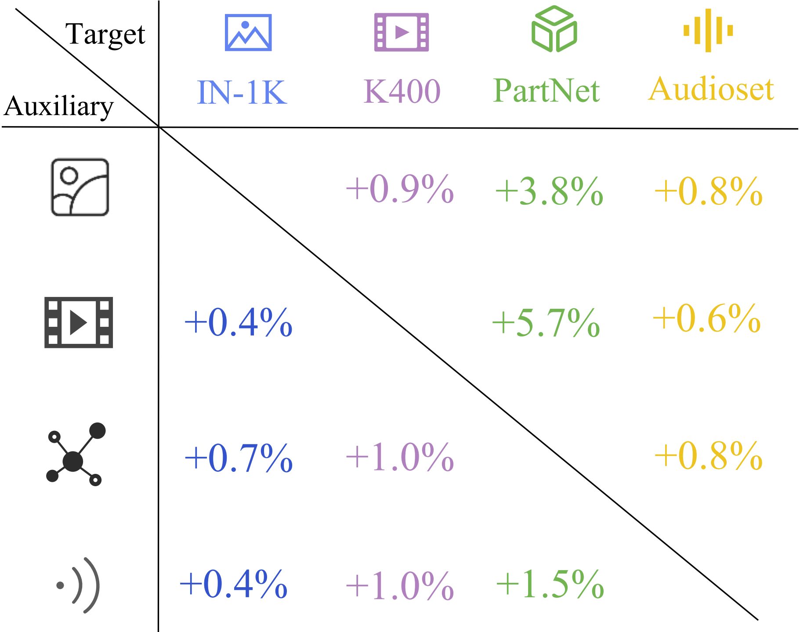

<h1 class="title">Multimodal Pathway: Improve Transformers with Irrelevant Data from Other Modalities [CVPR 2024]</h1>

<p align="center" width="100%">

</p>

<div align="center">
     <span class="author-block">
    <a href="https://invictus717.github.io/" target="_blank">Yiyuan Zhang</a><sup>1</sup>,</span>
    <span class="author-block">
    <a href="https://dingxiaohan.xyz/" target="_blank">Xiaohan Ding</a><sup>2</sup>,
    </span>
    <span class="author-block">
    <a href="https://kxgong.github.io/" target="_blank">Kaixiong Gong</a><sup>1</sup>,</span>
    <span class="author-block">
    </span>
    <a href="https://geyixiao.com/" target="_blank">Yixiao Ge</a><sup>2</sup>,
    </span>
    <span class="author-block">
    <a href="https://scholar.google.com/citations?user=4oXBp9UAAAAJ&hl=en&oi=ao" target="_blank">Ying Shan</a><sup>2</sup>,
    </span>
    <span class="author-block">
    <a href="http://people.eecs.berkeley.edu/~xyyue/" target="_blank">Xiangyu Yue</a><sup>1</sup>
    </span>
</div>

<div align="center">
    <sup>1</sup>
    <a href='http://mmlab.ie.cuhk.edu.hk/' target='_blank'>The Chinese University of Hong Kong</a>&emsp;
    <sup>2</sup>
    <a href='https://ai.tencent.com/' target='_blank'>Tencent AI Lab</a>&emsp;
</div>

-----------------

[](https://arxiv.org/abs/2401.14405)
[](https://ailab-cvc.github.io/M2PT/)

### Inspiration of Multimodal Pathway
This diagram's composition is inspired by a figure in Jeff Dean's blog post, where he envisions "pathways" as a high-level concept for general AI models. Our proposed Multimodal Pathway Transformer is a novel approach, and we are delighted to discover that some of its effects align with Jeff Dean's high-level vision, such as training a single model to *do many things, enabling multiple senses, and making models sparse and efficient*. Multimodal Pathway Transformer can be seen as an initial exploration of this "pathways" concept in the context of basic Transformer models and multimodal learning. Read more about Jeff Dean's concept in <a href="https://blog.google/technology/ai/introducing-pathways-next-generation-ai-architecture/" target="_blank">his blog post</a>.

### Abstract
We propose to improve transformers of a specific modality with irrelevant data from other modalities, *e.g*, improve an ImageNet model with audio or point cloud datasets. We would like to highlight that the data samples of the target modality are irrelevant to the other modalities, which distinguishes our method from other works utilizing paired (*e.g.* CLIP) or interleaved data of different modalities. We propose a methodology named Multimodal Pathway - given a target modality and a transformer designed for it, we use an auxiliary transformer trained with data of another modality and construct pathways to connect components of the two models so that data of the target modality can be processed by both models. In this way, we utilize the universal sequence-to-sequence modeling abilities of transformers obtained from two modalities. As a concrete implementation, we use a modality-specific tokenizer and task-specific head as usual but utilize the transformer blocks of the auxiliary model via a proposed method named Cross-Modal Re-parameterization, which exploits the auxiliary weights without any inference costs. On the image, point cloud, video, and audio recognition tasks, we observe significant and consistent performance improvements with irrelevant data from other modalities.

<p align="center" width="100%">

</p>

## Model Zoo


|      Model      |   Modality   | Pretraining | #Param |                                               Google Drive | Tencent Cloud                                               |
| :------------: | :----------: | :----------------------: | :----: | :------: |:--------: | 
| ViT-B16  | Image |         MAE         |  86M  |   [ckpt](https://drive.google.com/file/d/1GG8W-n3rJwJKSfmFE7npARbeJTPYzDTo/view?usp=drive_link)    | [ckpt](https://share.weiyun.com/rFarvpGx)
| Audio ViT-B16  | Audio |         Audio MAE         |  86M  |   [ckpt](https://drive.google.com/file/d/1xSelnHFBB27tZjOtP_m8ehRon3Ea8zlR/view?usp=drive_link)    | [ckpt](https://share.weiyun.com/QLoaFJyi)
| Point ViT-B16  | Point |         Point MAE         |  86M  |   [ckpt](https://drive.google.com/file/d/1c3t4wcd34OU4E56tIjhOy91wiY3Pgt5_/view?usp=drive_link)    | [ckpt](https://share.weiyun.com/lnoMWqR8)
| Video ViT-B16  | Video |         Video MAE         |  86M  |   [ckpt](https://drive.google.com/file/d/17FDpa7qUrPGv6NYyHsUrAH1x_ZyaxQ0g/view?usp=sharing)    | [ckpt](https://share.weiyun.com/QSYmzg0I)

## Usage

* Demo of use:

    ```python
    #  Create Model
    import torch,timm
    model = timm.create_model("vit_base_patch16_224",pretrained = False)
    aux_model = timm.create_model("vit_base_patch16_224",pretrained = False)
    #  Load Pretrained Models
    pretrained_state_dict = torch.load("Image_ViT_B16.pth")
    aux_state_dict = torch.load("Audio_ViT_B16.pth")
    model.load_state_dict(pretrained_state_dict, strict=True)
    aux_model.load_state_dict(aux_state_dict, strict=True)
    #  Construct Multimodal Pathway
    from multimodal_pathway import reparameterize_aux_into_target_model
    reparameterize_aux_into_target_model(model, aux_model, layer_names=('attn.qkv', 'attn.proj', 'mlp.fc1','mlp.fc2'))
    ```

* For image recognition, please refer to [image doc](Image/README.md).

* For video recognition, please refer to [video doc](Video/README.md).

* For point cloud analysis, please refer to [pcd doc](Point/README.md).

* For audio recognition, please refer to [audio doc](Audio/README.md).

<section class="section" id="BibTeX">
    <div class="container is-max-desktop content">
      <h2 class="title">BibTeX</h2>
      If you find our work useful, please kindly cite:
      <pre><code>@article{zhang2024multimodal,
      title={Multimodal Pathway: Improve Transformers with Irrelevant Data from Other Modalities},
      author={Zhang, Yiyuan and Ding, Xiaohan and Gong, Kaixiong and Ge, Yixiao and Shan, Ying and Yue, Xiangyu},
      journal={arXiv preprint arXiv:2401.14405},
      year={2024}
    }</code></pre>
    </div>
</section>
